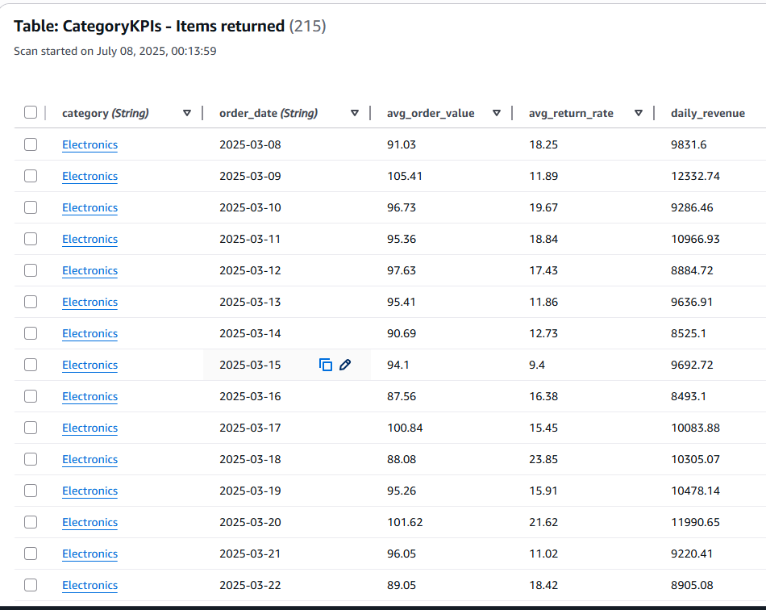

# Event-Driven E-Commerce Data Pipeline

## 1. Project Goal & Architecture Overview

### 1.1 Core Objective

The goal is to build a fully automated, production-grade data pipeline to ingest, validate, clean, and transform high-volume e-commerce data, computing key performance indicators (KPIs) for storage in a DynamoDB database. This enables real-time operational analytics and dashboarding, empowering stakeholders with insights into sales trends, customer behavior, and product performance for data-driven decisions.

### 1.2 Architectural Approach: Decoupled Micro-Batching

The pipeline uses a decoupled, micro-batching architecture to ensure scalability, reliability, and cost-efficiency, avoiding the inefficiencies of per-file triggers. Key principles include:

- **Decoupling**: File ingestion is separated from processing via an SQS queue, acting as a buffer to prevent system overload and data loss during high-volume uploads.
- **Micro-Batching**: A scheduled orchestrator processes batches of files, reducing compute overhead and enabling efficient Spark job execution.
- **Serverless First**: Utilizes AWS Lambda and Fargate for minimal operational overhead and automatic scaling, eliminating EC2 management.
- **Transactional Data Lake**: Delta Lake on S3 ensures ACID transactions, guaranteeing data consistency and reliability.

### 1.3 Architecture Diagram


### Step Function


### 1.4 Core Services

- **Data Lake & Storage**: Amazon S3, Delta Lake
- **Messaging & Buffering**: Amazon SQS
- **Compute**: AWS Lambda, Amazon ECS on AWS Fargate, Apache Spark
- **Orchestration**: AWS Step Functions, Amazon EventBridge Scheduler
- **Database**: Amazon DynamoDB
- **CI/CD**: GitHub, GitHub Actions
- **Notifications & Monitoring**: Amazon SNS, Amazon CloudWatch

## 2. The Workflow

1. **Ingestion & Buffering**:

   - Files (e.g., `orders_part1.csv`, `order_items_part1.csv`, `products.csv`) are uploaded to `s3://lab6-realtime-ecommerce-pipelines/input/`.
   - S3 Event Notifications send JSON messages to the `file-processing-queue` SQS queue.
   - The queue buffers messages, handling bursts durably.

2. **Scheduled Trigger**:

   - An EventBridge Scheduler (`Five-Minute-Pipeline-Trigger`) runs every 5 minutes, triggering the pipeline if files are available.

3. **Batch Orchestration (Lambda)**:

   - The `Pipeline-Orchestrator` Lambda polls the SQS queue, collecting all messages into a batch.
   - If files are collected, it starts the `ECommerce-Pipeline-Orchestrator` Step Function with a JSON payload (`execution_id`, file list).

4. **Step 1: Validation (ECS)**:

   - The `ValidationTask` validates files against schemas, producing a JSON result (`valid_files`, `invalid_files`) stored in `s3://.../results/{execution_id}.json`.

5. **Step 2: Result Retrieval (Lambda)**:

   - The `Read-Validation-Result` Lambda reads the JSON result from S3 and merges it into the Step Function payload.

6. **Step 3: Invalid File Handling**:

   - The `HandleInvalidFiles` step moves invalid files to the `rejected/` folder via copy-and-delete, preserving the payload.

7. **Step 4: Conditional Processing (Choice State)**:

   - If `valid_files` is not empty, proceeds to processing; otherwise, the workflow terminates.

8. **Step 5: Staging (ECS)**:

   - The `StagingTask` upserts valid files into Delta tables in `staging/`, based on file type (products, orders, order_items with partitioning).

9. **Step 6: Transformation (Spark on ECS)**:

   - The `TransformationTask` cleans data, joins tables, and computes KPIs, writing results to DynamoDB.

10. **Step 7: Archiving & Notification**:
    - The `ArchiveValidFiles` Map state moves valid files to `archive/` after successfully KPI computation and ingestion.
    - A success message is published to `PipelineSuccessNotifications` SNS topic; failures route to `PipelineFailureNotifications`.

## 3. Incremental Data Loading & Staging with Delta Lake

### 3.1 The Challenge of Incremental Updates

Incremental data may include new and updated records. Appending data risks duplicates (e.g., multiple prices for a product ID).

### 3.2 The Solution: Delta Lake Merge (Upsert)

The `StagingTask` uses Delta Lake's merge operation:

- Identifies primary keys (e.g., `id` for products, `order_id` for orders).
- Merges with target Delta table.
- Updates existing rows (`when_matched_update_all`) or inserts new rows (`when_not_matched_insert_all`).

### 3.3 Partitioning Strategy for Performance

- **Orders & Order_Items**: Partitioned by `year` and `month` from `created_at` (e.g., `.../staging/orders/year=2025/month=07/`), enabling partition pruning.
- **Products**: Partitioned by `department` for efficient department-based queries.

## 4. Data Formats, Schemas, and Validation

### 4.1 Input Data Formats

- **products.csv**:
  - Columns: `id, sku, cost, category, name, brand, retail_price, department`
- **orders.csv**:
  - Columns: `order_id, user_id, status, created_at, returned_at, shipped_at, delivered_at, num_of_item`
- **order_items.csv**:
  - Columns: `id, order_id, user_id, product_id, status, created_at, shipped_at, delivered_at, returned_at, sale_price`

### 4.2 Initial Validation Rules

The validator checks for all required columns per file type. Missing columns result in classification as invalid.

### 4.3 Data Cleaning & Wrangling Logic

The `TransformationTask` performs:

- **Trimming**: Removes whitespace from strings (e.g., `name`, `brand`).
- **Null Handling**: Replaces nulls in `category` or `department` with "Unknown".
- **Data Filtering**:
  - Excludes products with `cost` or `retail_price` ≤ 0.
  - Excludes orders with invalid `created_at` or `num_of_item` = 0.
  - Excludes order items with no `product_id` or `sale_price` ≤ 0.
- **Deduplication**: Removes duplicates by primary key (`id`, `order_id`).
- **Standardization**: Converts `status` fields to lowercase.

## 5. KPI Definitions and Calculations

### 5.1 Order-Level KPIs (Daily)


Stored in `OrderKPIs` table:

- **total_orders**: Count of unique orders.
- **total_revenue**: Sum of `sale_price` across all items.
- **total_items_sold**: Total items sold.
- **unique_customers**: Distinct `user_id` count.
- **return_rate**: `(Returned Orders / Total Orders) * 100`.

### 5.2 Category-Level KPIs (Daily)



Stored in `CategoryKPIs` table:

- **daily_revenue**: Sum of `sale_price` for items in a category.
- **avg_order_value**: `Daily Revenue / Total Category Orders`.
- **avg_return_rate**: `(Returned Items in Category / Total Items in Category) * 100`.

## 6. DynamoDB Schema and Access Patterns

- **CategoryKPIs Table**:
  - **Partition Key**: `category` (String)
  - **Sort Key**: `order_date` (String, YYYY-MM-DD)
  - **Access Pattern**: Query daily metrics for a category or specific day.
- **OrderKPIs Table**:
  - **Partition Key**: `order_date` (String, YYYY-MM-DD)
  - **Access Pattern**: Lookup overall business performance by day.

## 7. Error Handling, Reliability, and Logging

- **Graceful Failure Paths**: Step Functions `Catch` blocks route task failures to a failure branch.
- **Rejected Files**: Invalid files are moved to `rejected/` for inspection.
- **SNS Notifications**: Success/failure messages are sent to `PipelineSuccessNotifications`/`PipelineFailureNotifications`.
- **Centralized Logging**: ECS and Lambda logs are stored in CloudWatch.
- **Durable Queuing**: SQS with a Dead-Letter Queue captures failed messages.

## 8. Project Structure

```
.
├── .github/
│   └── workflows/
│       └── deploy.yml        # CI/CD pipeline for building/pushing Docker images
├── pipeline-orchestrator/
│   └── lambda_function.py    # Lambda code to poll SQS and start Step Function
├── read-validation-result/
│   └── lambda_function.py    # Lambda code to read S3 result file
├── staging/
│   ├── Dockerfile
│   ├── main.py               # Python script to merge data into Delta Lake
│   └── requirements.txt
├── transformer/
│   ├── Dockerfile            # Dockerfile using bitnami/spark
│   ├── main.py               # PySpark script for cleaning, transformation, KPIs
│   └── requirements.txt
├── validator/
│   ├── Dockerfile
│   ├── main.py               # Python script to validate batch files
│   └── requirements.txt
└── README.md                 # This file
```

## 9. Setup and Deployment Guide

### 9.1 Prerequisites

- AWS account with permissions for IAM, S3, SQS, Lambda, ECS, ECR, DynamoDB, and EventBridge.
- GitHub account and repository.

### 9.2 Infrastructure Setup

1. **Create S3 Bucket**:
   - Name: `lab6-realtime-ecommerce-pipelines`
   - Folders: `input/`, `archive/`, `rejected/`, `staging/`, `results/`
2. **Create SQS Queue**:
   - Name: `file-processing-queue`
   - Enable DLQ
   - Add S3 send message policy:
     ```json
     {
       "Effect": "Allow",
       "Principal": { "Service": "s3.amazonaws.com" },
       "Action": "sqs:SendMessage",
       "Resource": "arn:aws:sqs:YOUR_AWS_REGION:YOUR_AWS_ACCOUNT_ID:file-processing-queue",
       "Condition": {
         "ArnLike": {
           "aws:SourceArn": "arn:aws:s3:::lab6-realtime-ecommerce-pipelines"
         }
       }
     }
     ```
3. **Create DynamoDB Tables**:
   - `OrderKPIs`: Partition Key `order_date` (String), On-demand capacity.
   - `CategoryKPIs`: Partition Key `category` (String), Sort Key `order_date` (String), On-demand capacity.
4. **Create SNS Topics**:
   - Names: `PipelineSuccessNotifications`, `PipelineFailureNotifications`
   - Add email subscriptions and confirm.
5. **Create ECR Repositories**:
   - Names: `ecommerce-pipeline/validator`, `ecommerce-pipeline/staging`, `ecommerce-pipeline/transformer`
6. **Create ECS Cluster**:
   - Name: `lab6-ecommerce-cluster`
   - Infrastructure: AWS Fargate
7. **Create IAM Roles**:
   - `ECSPipelineTaskRole`: Permissions for S3, DynamoDB, SNS.
   - Lambda Roles: For `Pipeline-Orchestrator` (SQS, Step Functions) and `Read-Validation-Result` (S3 GetObject).
   - Step Function Role: Permissions for ECS RunTask, Lambda Invoke, SNS Publish.

### 9.3 Code Deployment with CI/CD

1. **Configure GitHub Secrets**:
   - Add `AWS_ACCESS_KEY_ID`, `AWS_SECRET_ACCESS_KEY`, `AWS_REGION` in repository settings.
2. **Push Code**:
   - Commit project files to the main branch. GitHub Actions (`deploy.yml`) builds and pushes Docker images to ECR.

### 9.4 Final Configuration

1. **Create ECS Task Definitions**:
   - Names: `validator-task`, `staging-task`, `transformer-task`
   - Use Fargate, link to ECR images, assign `ECSPipelineTaskRole`.
   - Allocate CPU/Memory (e.g., 1 vCPU, 4 GB for `transformer`).
2. **Deploy Lambda Functions**:
   - Names: `Pipeline-Orchestrator`, `Read-Validation-Result`
   - Upload code, set environment variables (`SQS_QUEUE_URL`, `STEP_FUNCTION_ARN`, `RESULT_BUCKET`).
3. **Deploy Step Function**:
   - Name: `ECommerce-Pipeline-Orchestrator`
   - Paste ASL definition, assign IAM role.
4. **Create S3 Event Notification**:
   - Trigger: `s3:ObjectCreated:Put` in `input/`
   - Destination: `file-processing-queue`
5. **Create EventBridge Schedule**:
   - Name: `Five-Minute-Pipeline-Trigger`
   - Schedule: Every 5 minutes
   - Target: `Pipeline-Orchestrator` Lambda

## 10. Simulation and Testing Instructions

### 10.1 Running the Pipeline

1. **Upload Data**: Upload `products.csv`, `orders.csv`, `order_items.csv` to `input/`.
2. **Monitor Queue**: Check `file-processing-queue` in SQS console for message count.
3. **Wait for Schedule**: Pipeline triggers every 5 minutes.
4. **Monitor Execution**: View `ECommerce-Pipeline-Orchestrator` in Step Functions console.
5. **Verify Results**:
   - Check `OrderKPIs` and `CategoryKPIs` in DynamoDB.
   - Confirm files moved from `input/` to `archive/` or `rejected/`.

### 10.2 Monitoring and Debugging

- **High-Level View**: Use Step Functions visual workflow to track batch status.
- **Real-time Logs**: Check CloudWatch Logs for ECS and Lambda.
- **Alerts**: Monitor `PipelineSuccessNotifications`/`PipelineFailureNotifications` emails.
- **Failed Messages**: Inspect `file-processing-queue-dlq` for persistent failures.
